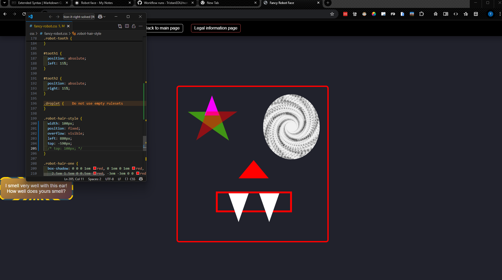
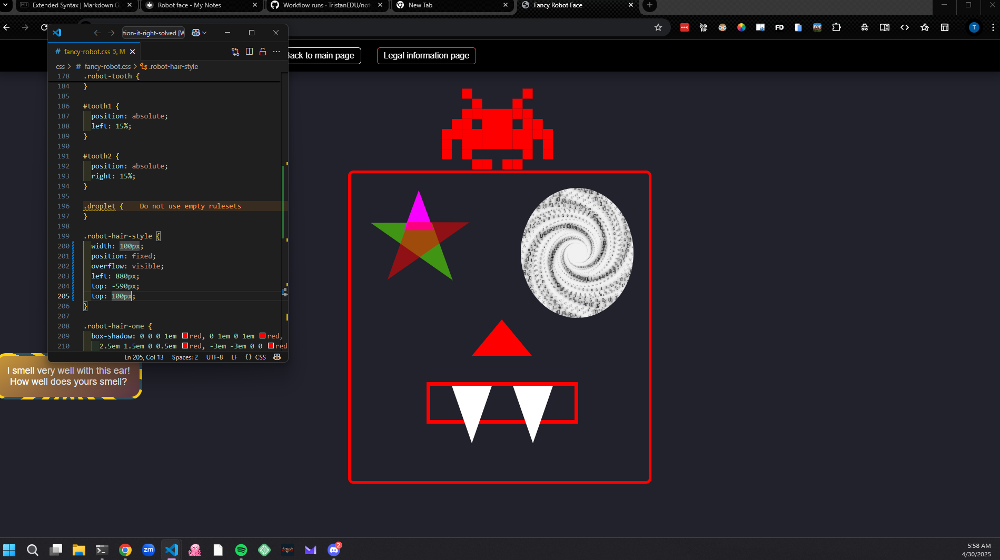
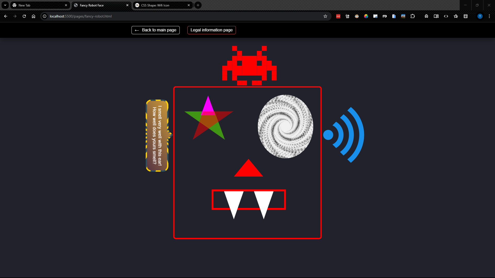
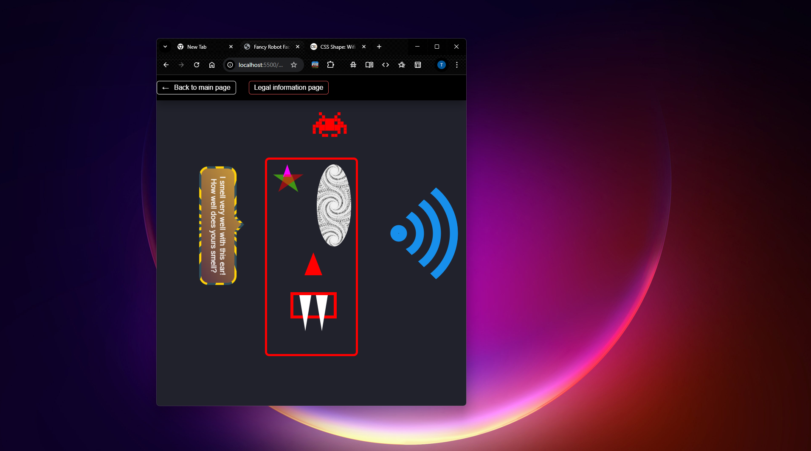

#Robot Face

- Russ said to look at abosolute positioning and z-index for blood drops
- Amber said to read this [article on droplet effect](https://deothemes.com/css-animated-rain-drop-effect/) She specificly said to read it line by line.


###Hair
- I am trying to position the element with the class of ".robot-hair-style" on top of ".robot-face-shape" the image below shows what it is now. I beleive the best way to do this is to use a relitive position but I am wondering how you can get it right without trial and error... I feel that there should be a way to acomplish this without that. 
- It did work to do it that way using the code 
```.robot-hair-style {
  position: relative;
  left: 46vw;
  top: -50vh;
}```
however I was surprised by the needing to use `-50vh` for the vertical positioning... I had was guessing that it would have been closer to `10vh`. As of yet I have not been able to figure out why this is. In my current understanding `top: 10vh;` indicates that it will position from the top of the viewport 10 vh units down to the top of the element being positioned. 
- It still does not scale the way I want it to but it does give me some range of flexibility. I think that a possible update would be to use the font size we set in `robot-container` and use rem similer to the way we made the hair properly scale but I do not understand that enough yet to be sure. It is also possible that we could use absolute and figure out how to give it a position relitive to the face... 


###LH Ear
I am working on the LH ear and I used the code snippet found below that I got from [here /#30](https://css-generators.com/tooltip-speech-bubble/)
<details>
  <summary>Click to expand code snippet</summary>

  <pre><code>/* HTML: &lt;div class="tooltip"&gt;This is a Tooltip with a border and a border radius. Border and background have a gradient coloration &lt;/div&gt; */
.tooltip {
  color: #fff;
  font-size: 18px;
  max-width: 28ch;
  text-align: center;
}
.tooltip {
  /* triangle dimension */
  --a: 90deg; /* angle */
  --h: 1em; /* height */

  --p: 49%; /* triangle position (0%:left 100%:right) */
  --b: 5px; /* border width */
  --r: 1.2em; /* the radius */

  padding: 1em;
  border: var(--b) solid #0000;
  border-radius: min(var(--r), var(--p) - var(--h) * tan(var(--a) / 2))
    min(var(--r), 100% - var(--p) - var(--h) * tan(var(--a) / 2)) var(--r)
    var(--r) / var(--r);
  background: padding-box linear-gradient(-30deg, #563444, #cf9d38),
    /* background gradient */ border-box
      repeating-conic-gradient(#2f505e 0 8deg, #ffd109 0 16deg); /* border gradient  */
  background-size: 100% calc(100% + var(--h));
  background-position: bottom;
  position: relative;
  z-index: 0;
}
.tooltip:before,
.tooltip:after {
  content: "";
  position: absolute;
  z-index: -1;
  inset: calc(-1 * var(--b) - var(--h)) calc(-1 * var(--b)) calc(-1 * var(--b));
  background: inherit;
}
.tooltip:before {
  background-size: 0 0, 100% 100%;
  clip-path: polygon(
    min(100%, var(--p) + var(--h) * tan(var(--a) / 2)) calc(var(--h) + var(--b)),
    min(100%, var(--p) + var(--h) * tan(var(--a) / 2)) var(--h),
    var(--p) 0,
    max(0%, var(--p) - var(--h) * tan(var(--a) / 2)) var(--h),
    max(0%, var(--p) - var(--h) * tan(var(--a) / 2)) calc(var(--h) + var(--b))
  );
}
.tooltip:after {
  border: inherit;
  background-size: 100% 100%, 0 0;
  clip-path: polygon(
    min(
        100% - var(--b),
        var(--p) + var(--h) * tan(var(--a) / 2) - var(--b) *
          tan(45deg - var(--a) / 4)
      )
      calc(var(--h) + var(--b)),
    var(--p) calc(var(--b) / sin(var(--a) / 2)),
    max(
        var(--b),
        var(--p) - var(--h) * tan(var(--a) / 2) + var(--b) *
          tan(45deg - var(--a) / 4)
      )
      calc(var(--h) + var(--b)),
    50% 50%
  );
}
  </code></pre>

</details>

- In the `.tooltip:after` section my W3C validation came up with a problem on the second to last line with the simi-colon... it apears that it is causing a parse error which I suspect is also why it is not rendering in the browser. 
	- The issue with the rendering turned out to be a result of not saving the the class changes to my HTML...
	- I am still unsure as to the issue with the clip-path. As best I can till the syntax is correct

- It apears that the changes to the ear have affected the positioning of the my hair element. I think that I may need to re-evaluate my aproach to positioning it. It is possible that I may be able to fix this by changing the positioning of the `.tooltip` element however I think that it will be better to fix the hair first. 

###Hair cont.
- I think that I need to use either Fixed or absolute... Probably fixed. I do not under stand why relitive is not working aside that it has to do with how it plays off of the other elements right before it. Here is the current code:
<details>
  <summary>Click to expand code snippet</summary>

  <pre><code>
.robot-hair-style {
  position: relative;
  left: 46vw;
  top: -50vh;
}

.robot-hair-one {
  box-shadow: 0 0 0 1em red, 0 1em 0 1em red, -2.5em 1.5em 0 0.5em red,
    2.5em 1.5em 0 0.5em red, -3em -3em 0 0 red, 3em -3em 0 0 red,
    -2em -2em 0 0 red, 2em -2em 0 0 red, -3em -1em 0 0 red, -2em -1em 0 0 red,
    2em -1em 0 0 red, 3em -1em 0 0 red, -4em 0 0 0 red, -3em 0 0 0 red,
    3em 0 0 0 red, 4em 0 0 0 red, -5em 1em 0 0 red, -4em 1em 0 0 red,
    4em 1em 0 0 red, 5em 1em 0 0 red, -5em 2em 0 0 red, 5em 2em 0 0 red,
    -5em 3em 0 0 red, -3em 3em 0 0 red, 3em 3em 0 0 red, 5em 3em 0 0 red,
    -2em 4em 0 0 red, -1em 4em 0 0 red, 1em 4em 0 0 red, 2em 4em 0 0 red;
  background: red;
  width: 1em;
  height: 1em;
  overflow: hidden;
  margin: 50px 0 70px 65px;
}
  </code></pre>

</details>

- The issue is when I change the positioning to absolute, fixed or sticky it disapears everywhere. I cant even find in it in the dev tools. ~This may be a result of using relitive units when I was doing this...~ *Nevermind that was not the issue it does the same thing when I use pixels as well.* 
	- It turned out that I needed to manually set the width and aperently a second top of the `.robot-hair-style`. This makes it visible but does not fix the relitive positioning and I find the extra top selector very odd...  
	- It turns out that I need to remove the top selector that makes it negitive as when I changed the positioning scheme from relitive to fixed this caused the point where top was being measured from to change [*see css-refernce note*](../references/CSS-resources.md). I still do not understand why width does not work and I would still like to figure out how to make this responsive but I may leave that for another time...
	- I figured out what the issue is, I had a faulty understanding of how `position: relitive;` and `position: fixed;` worked. As it turns out relitive measures from it's parent container which means that I was positioning my hair off screen.

###LH Ear
- I transitioned everything to `position: fixed;` which has fixed most of my issues and then I positiond everything by the side closest to the robot face *eg. LH ear is position from the right...*
- The position fixed has fixed everything aside from my issue with the hair not centering properly when I shrink the screen to much.

##Robot in General
Overal I am happy with it there is still a positioning issue when you magorly change the size of the screen as the screen shots below show. I am not sure that they can be fixed while still staying inside of the project guidlines.
 

####HTML

<details>
  <summary>Click to expand code snippet</summary>

  <code><pre>
<!DOCTYPE html>
<html lang="en">
  <head>
    <meta charset="UTF-8" />
    <meta name="viewport" content="width=device-width, initial-scale=1.0" />
    <link rel="stylesheet" href="../css/styles.css" />
    <link rel="stylesheet" href="../css/fancy-robot.css" />
    <title>Fancy Robot Face</title>
  </head>
  <body>
    <header class="exercise-header">
      <nav class="top-nav">
        <ul>
          <li class="back-button">
            <a href="/">Back to main page</a>
          </li>
          <li>
            <a href="./legal-page.html">Legal information page</a>
          </li>
        </ul>
      </nav>
    </header>
    <div class="robot-container">
      <div class="robot-face-shape">
        <div class="robot-eye-left">
          <div id="star-five"></div>
        </div>
        <div class="robot-eye-right"></div>
        <div class="robot-nose"></div>
        <div class="robot-teeth">
          <div class="robot-tooth" id="tooth1">
            <div class="droplet"></div>
          </div>
          <div class="robot-tooth" id="tooth2">
            <div class="droplet"></div>
          </div>
          <!-- <div class="robot-tooth"></div> -->
          <!-- <div class="robot-tooth"></div> -->
          <!-- <div class="robot-tooth"></div> -->
          <!-- <div class="robot-tooth"></div> -->
          <!-- <div class="robot-tooth"></div> -->
          <!-- <div class="robot-tooth"></div> -->
          <!-- <div class="robot-tooth"></div> -->
          <!-- <div class="robot-tooth"></div> -->
          <!-- <div class="robot-tooth"></div> -->
          <!-- <div class="robot-tooth"></div> -->
        </div>
      </div>
      <div class="robot-ear-left">
        <div class="tooltip">
          I smell very well with this ear! How well does yours smell?
        </div>
      </div>
      <div class="robot-ear-right"></div>
      <div class="robot-hair-style">
        <div class="robot-hair-one"></div>
        <!-- <div class="robot-hair-two"></div>
        <div class="robot-hair-three"></div> -->
      </div>
    </div>
  </body>
</html>
  </code></pre>

</details>

####CSS

<details>
  <summary>Click to expand code snippet</summary>

  <code><pre>
.robot-container {
  font-size: 1vw;
}

.robot-face-shape {
  position: fixed;
  top: 25vh;
  left: 35vw;
  bottom: 25vh;
  right: 35vw;
  border: 5px red solid;
  border-radius: 10px;
  width: 30vw;
  height: 60vh;
}

.robot-eye-left {
  position: absolute;
  top: 0;
  left: 0;
  width: 11.2vw;
  height: 24.92vh;
  /* width: fit-content; */
  /* overflow: hidden; */
  padding: 2%;
  margin: 5%;
}

.robot-eye-left #star-five {
  margin: 2.5vw 0;
  position: relative;
  display: block;
  color: rgb(0, 102, 255);
  width: 0;
  height: 0;
  border-right: 5vw solid transparent;
  border-bottom: 3.5vw solid rgba(94, 255, 0, 0.521);
  border-left: 5vw solid transparent;
  transform: rotate(35deg);
}

.robot-eye-left #star-five:before {
  border-bottom: 4vw solid rgb(247, 0, 255);
  border-left: 1.5vw solid transparent;
  border-right: 1.5vw solid transparent;
  position: absolute;
  height: 0;
  width: 0;
  top: -2.25vw;
  left: -3.25vw;
  display: block;
  content: "";
  transform: rotate(-35deg);
}

.robot-eye-left #star-five:after {
  position: absolute;
  display: block;
  color: red;
  top: 0.15vw;
  left: -5.25vw;
  width: 0;
  height: 0;
  border-right: 5vw solid transparent;
  border-bottom: 3.5vw solid rgba(255, 0, 0, 0.493);
  border-left: 5vw solid transparent;
  transform: rotate(-70deg);
  content: "";
}

.robot-eye-right {
  position: absolute;
  top: 0;
  right: 0;
  width: 11.2vw;
  height: 24.92vh;
  background-image: url("./../assets/images/76191796-vector-data-flow-visualization-grayscale-big-data-flow-as-binary-numbers-strings-twisted-in-infinity.jpg");
  background-position: center;
  background-size: contain;
  border-radius: 50%;
  padding: 2%;
  margin: 5%;
}

.robot-ear-left {
  position: fixed;
  top: 40vh;
  /* left: 24.4vw; */
  right: 61vw;
}
/* HTML: <div class="tooltip">This is a Tooltip with a border and a border radius. Border and background have a gradient coloration </div> */
.tooltip {
  color: #fff;
  font-size: 18px;
  max-width: 28ch;
  text-align: center;
  rotate: 90deg;
}
.tooltip {
  /* triangle dimension */
  --a: 90deg; /* angle */
  --h: 1em; /* height */

  --p: 49%; /* triangle position (0%:left 100%:right) */
  --b: 5px; /* border width */
  --r: 1.2em; /* the radius */

  padding: 1em;
  border: var(--b) solid #0000;
  border-radius: min(var(--r), var(--p) - var(--h) * tan(var(--a) / 2))
    min(var(--r), 100% - var(--p) - var(--h) * tan(var(--a) / 2)) var(--r)
    var(--r) / var(--r);
  background: padding-box linear-gradient(-30deg, #563444, #cf9d38),
    /* background gradient */ border-box
      repeating-conic-gradient(#2f505e 0 8deg, #ffd109 0 16deg); /* border gradient  */
  background-size: 100% calc(100% + var(--h));
  background-position: bottom;
  position: relative;
  z-index: 0;
}
.tooltip:before,
.tooltip:after {
  content: "";
  position: absolute;
  z-index: -1;
  inset: calc(-1 * var(--b) - var(--h)) calc(-1 * var(--b)) calc(-1 * var(--b));
  background: inherit;
}
.tooltip:before {
  background-size: 0 0, 100% 100%;
  clip-path: polygon(
    min(100%, var(--p) + var(--h) * tan(var(--a) / 2)) calc(var(--h) + var(--b)),
    min(100%, var(--p) + var(--h) * tan(var(--a) / 2)) var(--h),
    var(--p) 0,
    max(0%, var(--p) - var(--h) * tan(var(--a) / 2)) var(--h),
    max(0%, var(--p) - var(--h) * tan(var(--a) / 2)) calc(var(--h) + var(--b))
  );
}
.tooltip:after {
  border: inherit;
  background-size: 100% 100%, 0 0;
  clip-path: polygon(
    min(
        100% - var(--b),
        var(--p) + var(--h) * tan(var(--a) / 2) - var(--b) *
          tan(45deg - var(--a) / 4)
      )
      calc(var(--h) + var(--b)),
    var(--p) calc(var(--b) / sin(var(--a) / 2)),
    max(
        var(--b),
        var(--p) - var(--h) * tan(var(--a) / 2) + var(--b) *
          tan(45deg - var(--a) / 4)
      )
      calc(var(--h) + var(--b)),
    50% 50%
  );
}

.robot-ear-right {
  rotate: 90deg;
  position: fixed;
  top: 30vh;
  left: 59vw;
  --n: 4; /* number of bars */

  height: 280px;
  aspect-ratio: 1;
  border-radius: 50%;
  --s: calc(100% / (2 * var(--n) - 1));
  background: repeating-radial-gradient(
    50% 50%,
    #0000 0,
    #178feb 1px calc(var(--s) - 1px),
    #0000 var(--s) calc(2 * var(--s))
  );
  mask: conic-gradient(#000 0 0) no-repeat 50% / var(--s) var(--s),
    conic-gradient(
      from -45deg at 50% calc(50% + var(--s) / 2),
      #000 90deg,
      #0000 0
    );
}

.robot-nose {
  position: absolute;
  top: 28vh;
  left: 12vw;
  width: 0;
  height: 0;
  border-left: 3vw solid transparent;
  border-right: 3vw solid transparent;
  border-bottom: 7vh solid red;
}

.robot-teeth {
  position: absolute;
  top: 40vh;
  left: 7.5vw;
  width: 15vw;
  height: 8vh;
  border: 7px solid red;
}

.robot-tooth {
  width: 0;
  height: 0;
  border-left: 2vw solid transparent;
  border-right: 2vw solid transparent;
  border-top: 11vh solid white;
}

#tooth1 {
  position: absolute;
  left: 15%;
}

#tooth2 {
  position: absolute;
  right: 15%;
}

.droplet {
}

.robot-hair-style {
  width: 100px;
  position: fixed;
  overflow: visible;
  left: 46.5vw;
  bottom: 76vh;
  /* top: 100px; */
}

.robot-hair-one {
  box-shadow: 0 0 0 1em red, 0 1em 0 1em red, -2.5em 1.5em 0 0.5em red,
    2.5em 1.5em 0 0.5em red, -3em -3em 0 0 red, 3em -3em 0 0 red,
    -2em -2em 0 0 red, 2em -2em 0 0 red, -3em -1em 0 0 red, -2em -1em 0 0 red,
    2em -1em 0 0 red, 3em -1em 0 0 red, -4em 0 0 0 red, -3em 0 0 0 red,
    3em 0 0 0 red, 4em 0 0 0 red, -5em 1em 0 0 red, -4em 1em 0 0 red,
    4em 1em 0 0 red, 5em 1em 0 0 red, -5em 2em 0 0 red, 5em 2em 0 0 red,
    -5em 3em 0 0 red, -3em 3em 0 0 red, 3em 3em 0 0 red, 5em 3em 0 0 red,
    -2em 4em 0 0 red, -1em 4em 0 0 red, 1em 4em 0 0 red, 2em 4em 0 0 red;
  background: red;
  width: 1em;
  height: 1em;
  overflow: hidden;
  margin: 50px 0 70px 65px;
}

.robot-hair-two {
}

.robot-hair-three {
}
  </code></pre>

</details>
