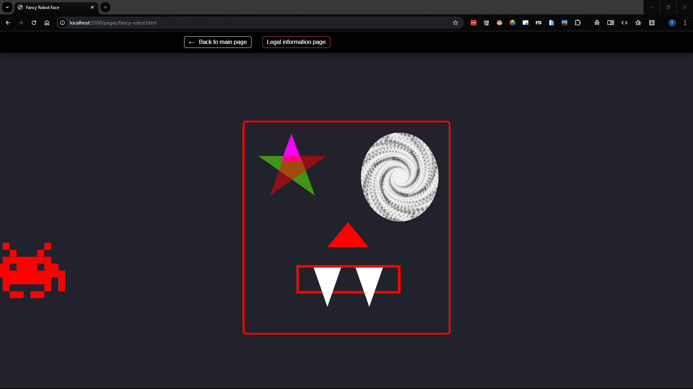
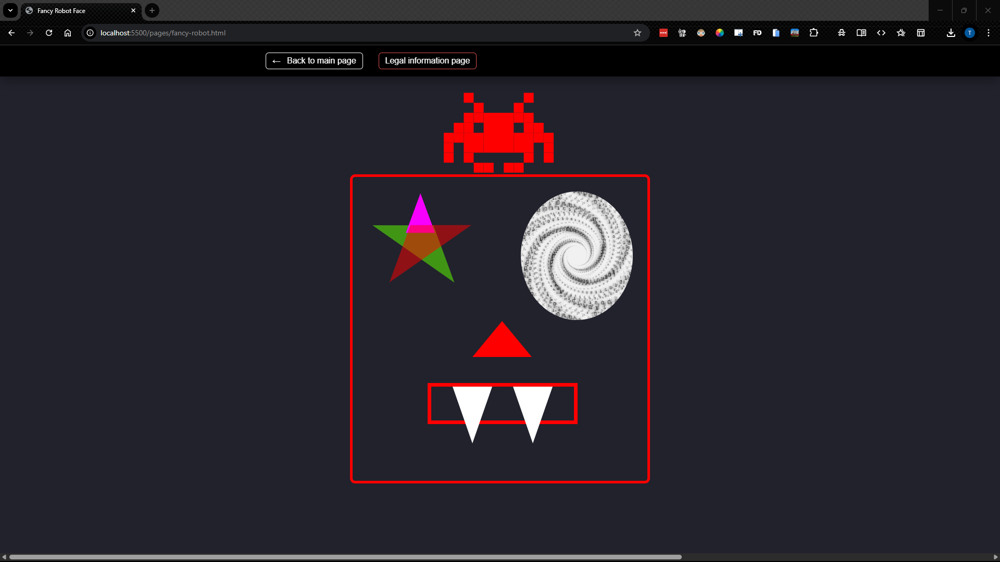
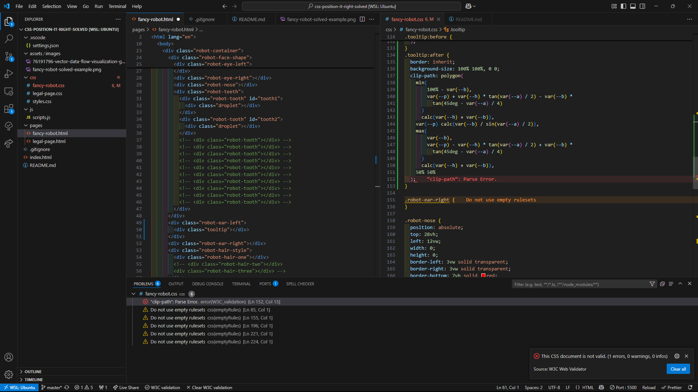
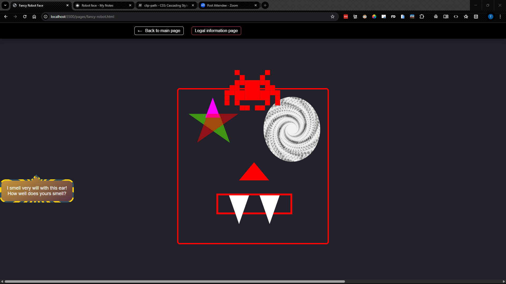

#Robot Face

##4/22/25
- Russ said to look at abosolute positioning and z-index for blood drops
- Amber said to read this [article on droplet effect](https://deothemes.com/css-animated-rain-drop-effect/) She specificly said to read it line by line.

##4/28/25

###Hair
- I am trying to position the element with the class of ".robot-hair-style" on top of ".robot-face-shape" the image below shows what it is now. I beleive the best way to do this is to use a relitive position but I am wondering how you can get it right without trial and error... I feel that there should be a way to acomplish this without that. 
- It did work to do it that way using the code 
```.robot-hair-style {
  position: relative;
  left: 46vw;
  top: -50vh;
}```
however I was surprised by the needing to use `-50vh` for the vertical positioning... I had was guessing that it would have been closer to `10vh`. As of yet I have not been able to figure out why this is. In my current understanding `top: 10vh;` indicates that it will position from the top of the viewport 10 vh units down to the top of the element being positioned. 
- It still does not scale the way I want it to but it does give me some range of flexibility. I think that a possible update would be to use the font size we set in `robot-container` and use rem similer to the way we made the hair properly scale but I do not understand that enough yet to be sure. It is also possible that we could use absolute and figure out how to give it a position relitive to the face... 

##4/29/25

###LH Ear
I am working on the LH ear and I used the code snippet found below that I got from [here /#30](https://css-generators.com/tooltip-speech-bubble/)
<details>
  <summary>Click to expand code snippet</summary>

  <pre><code>/* HTML: &lt;div class="tooltip"&gt;This is a Tooltip with a border and a border radius. Border and background have a gradient coloration &lt;/div&gt; */
.tooltip {
  color: #fff;
  font-size: 18px;
  max-width: 28ch;
  text-align: center;
}
.tooltip {
  /* triangle dimension */
  --a: 90deg; /* angle */
  --h: 1em; /* height */

  --p: 49%; /* triangle position (0%:left 100%:right) */
  --b: 5px; /* border width */
  --r: 1.2em; /* the radius */

  padding: 1em;
  border: var(--b) solid #0000;
  border-radius: min(var(--r), var(--p) - var(--h) * tan(var(--a) / 2))
    min(var(--r), 100% - var(--p) - var(--h) * tan(var(--a) / 2)) var(--r)
    var(--r) / var(--r);
  background: padding-box linear-gradient(-30deg, #563444, #cf9d38),
    /* background gradient */ border-box
      repeating-conic-gradient(#2f505e 0 8deg, #ffd109 0 16deg); /* border gradient  */
  background-size: 100% calc(100% + var(--h));
  background-position: bottom;
  position: relative;
  z-index: 0;
}
.tooltip:before,
.tooltip:after {
  content: "";
  position: absolute;
  z-index: -1;
  inset: calc(-1 * var(--b) - var(--h)) calc(-1 * var(--b)) calc(-1 * var(--b));
  background: inherit;
}
.tooltip:before {
  background-size: 0 0, 100% 100%;
  clip-path: polygon(
    min(100%, var(--p) + var(--h) * tan(var(--a) / 2)) calc(var(--h) + var(--b)),
    min(100%, var(--p) + var(--h) * tan(var(--a) / 2)) var(--h),
    var(--p) 0,
    max(0%, var(--p) - var(--h) * tan(var(--a) / 2)) var(--h),
    max(0%, var(--p) - var(--h) * tan(var(--a) / 2)) calc(var(--h) + var(--b))
  );
}
.tooltip:after {
  border: inherit;
  background-size: 100% 100%, 0 0;
  clip-path: polygon(
    min(
        100% - var(--b),
        var(--p) + var(--h) * tan(var(--a) / 2) - var(--b) *
          tan(45deg - var(--a) / 4)
      )
      calc(var(--h) + var(--b)),
    var(--p) calc(var(--b) / sin(var(--a) / 2)),
    max(
        var(--b),
        var(--p) - var(--h) * tan(var(--a) / 2) + var(--b) *
          tan(45deg - var(--a) / 4)
      )
      calc(var(--h) + var(--b)),
    50% 50%
  );
}
  </code></pre>

</details>

- In the `.tooltip:after` section my W3C validation came up with a problem on the second to last line with the simi-colon... it apears that it is causing a parse error which I suspect is also why it is not rendering in the browser. 
	- The issue with the rendering turned out to be a result of not saving the the class changes to my HTML...
	- I am still unsure as to the issue with the clip-path. As best I can till the syntax is correct

- It apears that the changes to the ear have affected the positioning of the my hair element. I think that I may need to re-evaluate my aproach to positioning it. It is possible that I may be able to fix this by changing the positioning of the `.tooltip` element however I think that it will be better to fix the hair first. 

###Hair
- I think that I need to use either Fixed or absolute... Probably fixed. I do not under stand why relitive is not working aside that it has to do with how it plays off of the other elements right before it. Here is the current code:<details>
  <summary>Click to expand code snippet</summary>

  <pre><code>
.robot-hair-style {
  position: relative;
  left: 46vw;
  top: -50vh;
}

.robot-hair-one {
  box-shadow: 0 0 0 1em red, 0 1em 0 1em red, -2.5em 1.5em 0 0.5em red,
    2.5em 1.5em 0 0.5em red, -3em -3em 0 0 red, 3em -3em 0 0 red,
    -2em -2em 0 0 red, 2em -2em 0 0 red, -3em -1em 0 0 red, -2em -1em 0 0 red,
    2em -1em 0 0 red, 3em -1em 0 0 red, -4em 0 0 0 red, -3em 0 0 0 red,
    3em 0 0 0 red, 4em 0 0 0 red, -5em 1em 0 0 red, -4em 1em 0 0 red,
    4em 1em 0 0 red, 5em 1em 0 0 red, -5em 2em 0 0 red, 5em 2em 0 0 red,
    -5em 3em 0 0 red, -3em 3em 0 0 red, 3em 3em 0 0 red, 5em 3em 0 0 red,
    -2em 4em 0 0 red, -1em 4em 0 0 red, 1em 4em 0 0 red, 2em 4em 0 0 red;
  background: red;
  width: 1em;
  height: 1em;
  overflow: hidden;
  margin: 50px 0 70px 65px;
}
  </code></pre>

</details>

	- The issue is when I change the positioning to absolute, fixed or sticky it disapears everywhere. I cant even find in it in the dev tools. ~~*This may be a result of using relitive units when I was doing this.../*~~ *Nevermind that was not the issue it does the same thing when I use pixels as well.* 
	- 
